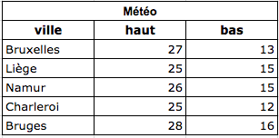

[Becode](../../../) / [parcours](../../) / [SQL](../) / Select


# SELECT FROM
 
La plupart du temps, dans le jargon CRUD, tu voudras faire du "Read", c'est à dire, extraire des données depuis mySql pour les manipuler ensuite dans ton script PHP.   

Cela se passe ainsi: ton script PHP une requête formulée en SQL, et mysql lui retourne un tableau avec les résultats de la requête. ([Voici un schéma](./assets/mysql-architecture.png) pour comprendre tout le processus de traitement d'une requête http, passant par Apache, PHP et MySQL). 

Par exemple, dans la table météo ton application veut savoir quelle sera la température maximale à Bruxelles. Pour le savoir, elle doit "lire" la cellule se trouvant dans la colonne "haut" de la rangée "Bruxelles".  Si ce n'est pas clair, relis cette phrase plus lentement.




En SQL, cela signifie simplement que tu voudras chercher une ou plusieurs rangées d'une table bien définie.  
 
Le squelette de syntaxe à respecter est ainsi:

```sql
SELECT
colonne1, colonne2, colonne3, colonne4
FROM 
nom_de_la_table
WHERE
condition
;
```

Donc, dans notre exemple de la météo, la requête à formuler est:

```sql
SELECT
haut
FROM 
météo
WHERE
ville='Bruxelles'
;
```

qui retournera un tableau constitué d'une cellule, contenant la valeur demandée.

**Note:** Chaque requête doit se terminer par `;`, comme en PHP et en Javascript.  
**Note:** tu peux aussi l'écrire en une seule ligne horizontale. Dans tous les cas, n'oublie pas le point-virgule à la fin.

Les noms de colonne qui suivent le mot-clé **SELECT** définissent les colonnes qui seront renvoyées dans les résultats. Tu peux sélectionner autant de noms de colonnes que nécessaire, ou utiliser le signe `*` pour sélectionner **toutes** les colonnes.  

```sql
SELECT * FROM météo WHERE ville='Bruxelles';
```

Le nom de la table qui suit le mot-clé **FROM** spécifie la table qui sera interrogée pour récupérer les résultats souhaités.

La **clause "WHERE"** est facultative. Elle permet de spécifier quelles valeurs ou lignes de données seront renvoyées ou affichées, en fonction des critères décrits après le mot-clé `WHERE`.

La partie **conditionnelle** (juste après `WHERE`) peut utiliser ces opérateurs:

```sql
=	"égal à"
>	"plus grand que"
<	"plus petit que"
>=	"plus grand ou égal à"
<=	"plus petit ou égal à"
<>	"différent de"
LIKE "qui ressemble à"
```
**Note Concernant `LIKE`** : il permet de retourner des rangées qui "ressemblent à" une chaîne de caractère que tu spécifies, accompagnée du signe `%`, signe voulant dire "n'importe quel chaîne de caractère". Pour un ordinateur, cela signifie soit:

- "qui **commence** par *chaine_de_caractères*".   ( `LIKE 'Er%' ` : tout mot commençant par "Er"),  
- "qui **termine** par *chaine_de_caractères*" ( `LIKE '%Er' ` : tout mot terminant par "Er"),  
- ou "qui **contient** cette *chaine_de_caractères*" ( `LIKE '%Er%'` : tout mot contenant "Er").  

C'est très utile pour ajouter une fonctionnalité de recherche dans votre application.  
Pour des exemples, lire [plus d'infos ici](http://www.sqlcourse.com/select.html)

### Exercices de SELECT 

#### Drill 1
Rends-toi sur notre premier [bac à sable d'apprentissage](http://sqlfiddle.com/#!9/6ddfd/2).

Utilise la zone éditable à droite pour écrire tes premières requêtes SQL.  

Trouve la syntaxe pour effectuer chacune des requêtes suivantes (lis bien la formulation, chaque mot a son importance!). Vérifie 

*Retourne un tableau contenant*  

1. *uniquement les villes* 
1. *toutes les villes et leur température maximum*
1. *toutes les villes et leur température minimum* 
1. *La ou les villes dont la température maximale dépasse 27 degrés*
1. *La ou les villes dont la température minimale sera inférieure ou égale à 15 degrés*
1. *La ou les villes dont la température sera égale à 15 degrés*
1. *La ou les villes dont la température ne sera PAS égale à 15 degrés*
1. *La ou les villes dont le nom commence par "Br"*
1. *La ou les villes dont la température maximale se situe entre 26 et 28 degrés*
1. *La ou les  villes dont la température minimale est égale à 14 ou est égale à 16 degrés*
1. *La ou les villes dont la température maximale est supérieure ou égale à 26 et la température minimale est inférieure à 14*

Fait? Tu as tout réussi? Alors passe à notre second Drill.

#### Drill 2
Rends-toi sur le second [bac à sable d'apprentissage](http://sqlfiddle.com/#!9/3c37f/1). 

Familiarise toi d'abord avec cette table. Que contient-elle? quelles sont les colonnes?
Ensuite, même principe que ci-dessus: 

*Trouve la syntaxe pour effectuer chacune des requêtes suivantes:*

1. *Affiche tous les octocats et leurs données*
2. *Affiche uniquement les prénoms*
3. *Affiche les prénoms, noms et age de chaque octocat*
4. *Affiche les octocats dont le nom commence par 'N'*
5. *Affiche le prénom et le nom des octocats de la promo "promo1-central"*
6. *Affiche le prénom, le nom et l'année de naissance des octocats de la promo "promo1-anderlecht"*

### TRIER : ORDER BY
Tu peux demander à MySQL de trier les résultats selon un ordre que tu définis. Pour cela, ajoute à la fin de ta requête: `ORDER BY` suivi de la colonne à utiliser pour le tri, suivi soit de `ASC` ("ascending order", de A à Z par exemple ou de la moins grande valeur à la plus grande valeur) ou de `DESC` ("descending order", de Z à A).

Ex:
```sql
SELECT ville FROM météo ORDER BY ville ASC;
```

### LIMITER LE NOMBRE DE RÉSULTATS

Tu peux dire à SQL de limiter le nombre de résultats, en ajoutant le mot-clef `LIMIT`suivi de la rangée de départ (on commence à 0) puis une virgule, puis le nombre de rangées à garder.

Par exemple, pour ne garder que la rangée du dessus, on ajoute `LIMIT 0,1` à la requête:

```sql
SELECT ville FROM météo ORDER BY ville ASC LIMIT 0,1 ;
```


#### Drill 3
1. *Affiche le prénom et nom de tous les octocats, par ordre alphabétique ascendant du prénom.*
1. *Affiche le prénom et nom de tous les octocats, par ordre alphabétique descendant du nom de famille.*
1. *Affiche le prénom, nom et âge de tous les octocats, du plus jeune au plus âgé.*
1. *Affiche le prénom, nom et âge de tous les octocats, du plus âgé au plus jeune.*
1. *Affiche le prénom, nom et âge de tous les octocats, du plus jeune au plus âgé, de la promo "promo1-central".*
1. *Affiche le prénom, nom et âge de tous les octocats, du plus jeune au plus âgé, de la promo "promo1-central" et dont l'âge se situe entre 23 et 28 ans.*
1. *Affiche le prénom, nom, âge et genre de tous les octocats, du plus jeune au plus âgé, de la promo "promo1-central" et dont l'âge se situe entre 25 et 35 ans.*
1. *Affiche le prénom, nom, âge et genre de tous les octocats, du plus jeune au plus âgé, de la promo "promo1-central", dont l'âge se situe entre 25 et 35 ans et dont le genre est masculin.*


### Bonus: SQL inclut des fonctions utiles
En voici deux qu'on utilise souvent: "concat" et "count". Il y en a de nombreuses autres.

#### concat
Elle permet de concaténer des colonnes pour recevoir un tableau plus facile à traiter ensuite en PHP.
Par exemple, tu peux faire ceci:

```sql
SELECT CONCAT('ville: ', ville, ': ', bas, '/', haut ) FROM météo;
```

#### count
Tu veux savoir combien il y a de villes dans le tableau? Tu peux simplement demander via SQL en utilisant la fonction COUNT().

```sql
SELECT COUNT(*) FROM météo;
```

Tu veux vérifier qu'il n'y a pas eu une double entrée pour Bruxelles? Utilise COUNT() et une clause WHERE pour savoir le nombre de fois que "Bruxelles" se trouve dans la table *météo*.

```sql
SELECT COUNT(*) FROM météo WHERE ville='Bruxelles';
```

Pour en savoir plus sur ces fonctions, va voir sur [openclassroom](https://openclassrooms.com/courses/concevez-votre-site-web-avec-php-et-mysql/les-fonctions-sql).


#### Drill 4

1. *Combien y a-t-il de garçons à Becode?*
1. *Combien y a-t-il de filles à Becode/Central ?*
1. *Combien y a-t-il de garçons à Becode/Central ?*
1. *Combien y a-t-il d'octocats dont le prénom est 'Nadia' à becode?*
1. *Sur ce nouveau [SQLFiddle](http://sqlfiddle.com/#!9/6b056/2), trouve la fonction permettant de n'afficher que l'année de la colonne "birthdate" et affiche le prénom de tous les octocts et leur année de naissance.  (indice: comment dit-on "année" en anglais?)*

Sur le sqlfiddle [bac à sable de Météo](http://sqlfiddle.com/#!9/6ddfd/2):

1. *Trouve la fonction permettant de retourner un tableau contenant uniquement la température **maximale** prévue ("Demain le maxima observé en Belgique sera de ... degrés")*
1. *Trouve la fonction permettant de retourner un tableau contenant uniquement la température **minimale** prévue ("Demain le minima observé en Belgique sera de ... degrés")*

### Aller plus loin par toi-même
C'est la fin du parcours SQL sur les SELECT. Tu en sais largement assez pour développer. Lorsque tu auras envie d'aller plus loin, voici des ressources très bien faites.  

- passe le [quizz SQL de la W3School](https://www.w3schools.com/quiztest/quiztest.asp?qtest=SQL) 
- Utiliser les fonctions SQL, sur [openclassroom](https://openclassrooms.com/courses/concevez-votre-site-web-avec-php-et-mysql/les-fonctions-sql).
- Les bases du Select, expliqué par sqlcourse.com: [Basics of Select](http://www.sqlcourse.com/select.html) 
- Trucs et astuces avec Select, expliqué par sqlcourse.com: [Powerful things to do with Select](http://www.sqlcourse2.com/select2.html)


## Continue le parcours SQL

1. [Intro](./readme.md)     
1. Read : [SELECT](./1.select.md)   ←
1. Create : [INSERT INTO](./2.insert.md)  
1. Update : [UPDATE](./3.update.md)
1. Delete : [DELETE FROM](./4.delete.md)
2. Pour [voler de tes propres ailes](./5.moveon.md)


