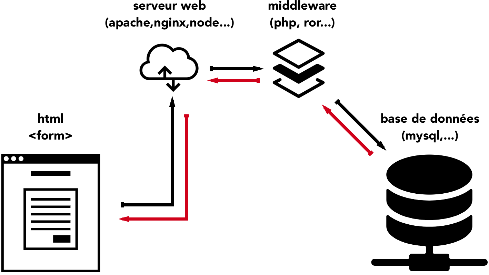
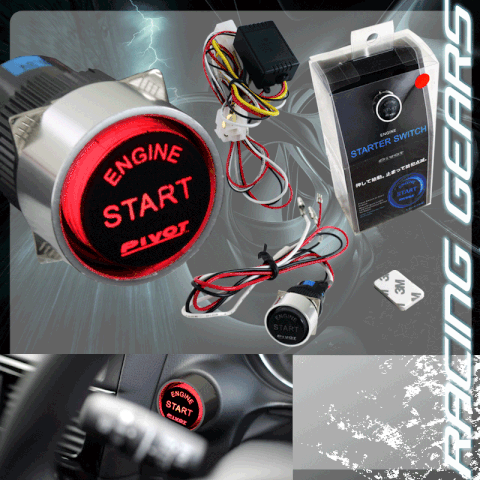

# Parcours backend : traitement d'un formulaire

Un "backend" est un outil de gestion de contenus tournant sur un serveur. Il existe une infinité de types de projets backend: CMS, CRM, Bug trackers... 

Dans cette diversité, il y a une récurrence : ce contenu doit pouvoir être créé, modifié, effacé, et bien sûr, lu par les différents utilisateurs du système. C'est ce qu'on appelle le **CRUD** : **C**reate, **R**ead, **U**pdate, **D**elete. 

Pour le C et le U, on a besoin de proposer au client (le navigateur, donc au "frontend") une interface d'ajout ou d'édition.  Sur le web, qui dit interface, dit html. Bienvenue dans le petit monde joyeux des Formulaires et de la balise `<form>`. 


Ce petit parcours vous propose d'apprendre à mettre en place une première interaction client-serveur minimale mais complète.

Au fond, on pourrait voir cela comme une **conversation** entre un humain et une machine. L'humain dit à la machine *"ajoute ce contenu dans la base de données"*, ou  *"modifie ce contenu puis remets-le à sa place dans la base de données"*, *"efface ce contenu de la base de données"*. 


Sauf que... le frontend ne peut pas directement interagir avec le serveur mysql (c'est juste pas possible, c'est comme cela). 


On a donc besoin d'une couche intermédiaire qui puisse dialoguer à la fois entre le code "frontend" (html) et le serveur de base de données, (en anglais: un *middleware*) :  tel que PHP, RubyOnRails, Java, ou même javascript (via nodejs).



Voilà, maintenant que vous avez la _big picture_ d'une transaction client-serveur, passons à la pratique.

## Création du formulaire

Quand on fait un formulaire, on pose des questions. Un peu comme une interview. Alors imagine que tu interviewes une star. Prenons par exemple [Jeanne Maes](https://www.youtube.com/watch?v=RvYAnsH0gEA). Nous pourrions lui poser ces questions: "comment t'appelles-tu ?", "Quel âge as-tu ?", Préfères-tu Plastic Bertrand ou Charles Aznavour ? Racontez-nous votre vie.

### Choisir les bons inputs
Afin de proposer une bonne UX et aussi d'avoir des bonnes données, bien valides (par ex: que l'âge soit toujours écrit avec des chiffres) on doit faire attention à utiliser les bons _inputs_.

Réfléchis à chacune de ces questions. Quel serait l' input le plus adéquat ?

#### 1. Comment t'appelles-tu ?
On s'attend à avoir... une brève chaîne de charactères. Quel(s) input correspond(ent) à cela ?

#### 2. Quel âge as-tu ?
On s'attend à avoir... un nombre fait de 1 à 3 chiffres. Quel(s) input correspond(ent) à cela ?

#### 3. Préfères-tu Plastic Bertrand ou Charles Aznavour ?
Ici, on ne veut recevoir qu'une seule réponse parmi deux propositions. Quel(s) input correspond(ent) à cela ?

#### 4. Raconte-moi ta vie.
Ici, on s'attend à recevoir un texte potentiellement très long.
Quel(s) input correspond(ent) à cela ?

### Choisir les bons noms de variables
Quelque soit l' input choisi, l'attribut permettant de fixer le nom de la variable qui sera envoyée au serveur est l'attribut `name`, et la valeur sera spécifiée dans l'attribut `value` (sauf pour le `textarea`).

```html
<textarea name="biography">Je suis née en ...</textarea>
<input name="fullname" type="text" value="Jeanne Maes">
<input name="age" type="number" value="18">
```

Lorsque le formulaire est soumis par l'utilisateur, les données du formulaire sont envoyées au script indiqué dans l'attribut `action`:

```php
<form method="post" action="formulaire.php">
```
(Note que la requête est en fait envoyée par le navigateur à http://nomdedomaine.tld/chemin/vers/le/formulaire.php.)

Ces données sont accessibles au script `formulaire.php` via une variable globale correspondant à l'attribut `method` du formulaire: soit `GET` soit `POST`.

```php
// En PHP, la commande
echo '<pre>';
print_r($_POST);

// retourne
Array
(
    [name] => Jeanne Maes
    [biography] => Je suis née en ...
    [age] => 18
)
```

Bien. C'est tout ce que tu dois comprendre pour ce qui concerne le frontend. Le reste de ton travail du côté client consiste à améliorer le look et l'ergonomie de ton formulaire via du CSS et du Javascript.

## Traitement du formulaire

Du côté serveur, par contre, il faut faire attention de ne pas exposer le système aux erreurs et aux tentatives de hacking.

C'est pour cela que le traitement d'un input externe (par exemple via un formulaire html) doit **toujours** passer par ces étapes, et dans cet ordre :

1. Sanitiser
2. Valider
3. Exécuter
4. Afficher (ou rediriger)

### 1. Sanitiser
La **sanitisation** sert à empêcher du contenu toxique de pénétrer dans ton système. Il s'agit d'éviter la corruption de ton système, typiquement via des attaques mal intentionnées de hackers, ou des maladresses de tes utilisateurs.


Exemple de sanitisation en PHP :

```php
// 1. Sanitisation
$email = filter_var($_POST['email'], FILTER_SANITIZE_EMAIL);
```
Ici, `$email` contient une version nettoyée de ce qui a été envoyé dans le formulaire. Donc si par exemple, dans l'input, l'utilisateur a mis `>>>jeanne@maes.fr%dùf` (genre que son chat a marché sur le clavier à ce moment-là), la fonction retournera `jeanne@maes.fr%df`. 

Nettoyée... de codes dangereux, ce qui ne veut pas dire que cela soit une adresse email valide ;-). 

(Voir la doc: [filter_var](http://php.net/manual/fr/filter.filters.sanitize.php))

### 2. Valider
La **validation** sert à vérifier que le(s) input(s) fourni(s) sont adaptés aux contraintes de ton application (par ex: si l'email est obligatoire pour s'inscrire, il faut vérifier que le formulaire contient bien une adresse email valide : accepter `john@doe.com`, mais refuser `john@doe` ) .  Voici une métaphore illustrant une validation qui se serait mal passée...  


L'input présente une configuration non envisagée par le système conçu par les designers de l'avion.

En php, cela donnerait ceci: 

```php
// 1. Sanitisation
$email = filter_var($_POST['email'], FILTER_SANITIZE_EMAIL);

// 2. Validation
if (true === filter_var($email, FILTER_VALIDATE_EMAIL)) {
    echo "Cette adresse email nettoyée est considérée comme valide.";
}
```

**Lorsqu'on construit une validation, on utilise toujours au moins une condition.** Si la variable (sanitisée) passe la validation on exécute. Autrement dit, on fait ceci, sinon on fait cela.


### 3. Exécuter
Lors de l'exécution, on effectue les changements du système (typiquement du CRUD : récupération, insertion, mise à jour et/ou effacement de données dans une base de données).



Typiquement, appuyer sur ce bouton va déclencher une série d'opérations cachées de l'utilisateur, mais permettant de changer le système (moteur éteint > moteur allumé).

Par exemple, on pourrait faire ceci :

```php
// on initie un tableau qui va contenir toute erreur potentielle.
$errors = array();
// 1. Sanitisation
$email = filter_var($_POST['email'], FILTER_SANITIZE_EMAIL);

// 2. Validation
if (false === filter_var($email, FILTER_VALIDATE_EMAIL)) {
   $errors['email'] =  "Cette adresse est invalide.";
}

// 3. Exécution
if (count($errors)> 0){
	echo 'Il y a des erreurs!';
	print_r($errors);
	exit;
}
// Si on arrive ici, c'est que tout va bien, on peut enregistrer
$bdd = new PDO('mysql:host=localhost;dbname=test', 'root', '');
//...
```


### 4. Afficher le nouvel état de l'interface
Le système ayant changé, l'interface présenté à l'utilisateur doit refléter ce changement.  
Par exemple: retourner du html affichant message de confirmation ou message d'erreur) ou via une redirection (en PHP, via ` header("Location: fichier.extension");` ). 


Voilà, j'espère que ce petit parcours vous aide à comprendre comment réaliser une interaction client-serveur via php et les concepts de sanitisation et de validation des données.

## Questions? 
--> Alexandre.