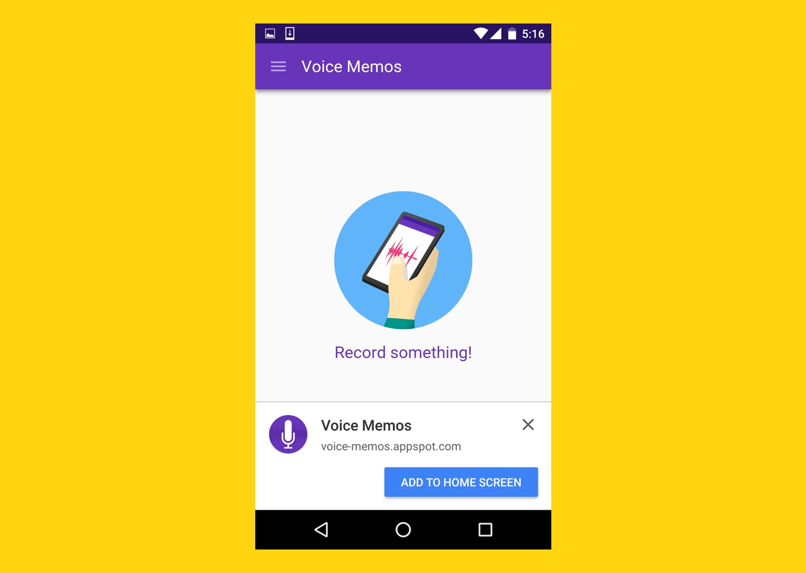

# Progressive Web Apps

## What is a PWA ?

Here's what Google's official introduction says:

> Progressive Web Apps are user experiences that have the reach of the web, and are:
>
> Reliable - Load instantly and never show the downasaur, even in uncertain network conditions.
Fast - Respond quickly to user interactions with silky smooth animations and no janky scrolling.
Engaging - Feel like a natural app on the device, with an immersive user experience.
This new level of quality allows Progressive Web Apps to earn a place on the user's home screen.

Basically, a PWA is a website that, when visited on a mobile phone, can be saved on the user's mobile and behaves just as a Native application: if the connection is lost, it still displays content.

This is possible thanks to a technology called **Service Workers** that allows you to save static assets in the user system (html,css, javascript,json...), alongside a `manifest.json` that specifies how the website should behave when.

## Examples
- https://plancomptablebelge.be/
- More examples: https://pwa.rocks/

## Setup
It may sound complicated, but it's not that difficult.

### 1. requirement: https instead of http
 The hard part is that it will only work on a website running on a secure domain (behind **https**:// instead of http://).
These are usually very hard to set up, but if you have your own server, you can use letsencrypt to make that super easy and automatic. And... FREE.

### 2. Tools
#### 2.1 lighthouse test
- the [lighthouse test](https://developers.google.com/web/tools/lighthouse/) is an automated test created and maintained by Google that test websites against three criteria : Progressive, Performance, Accessibility. It gives a score in percent for each, and advises on how to solve each issue. It's a great learning tool.
- realfavicongenerator.net
- the UpUp.js library

#### 2.2 realfavicongenerator.net
https://realfavicongenerator.net/ takes care of the visual layer of your PWA. It generates the manifest.json file mentioned above, alongside all the versions of your icons necessary when saving the website onto any mobile device. 

#### 2.3 service workers, via upup.js
Service Workers is a javascript technology. It's not too easy to grasp, but luckily, some smart people from Germany, wanting to push the "Offline First" philosophy, created a javascript library that makes it super easy to make your website behave nicely when the connexion drops. 

Just do the [UpUp tutorial](https://www.talater.com/upup/getting-started-with-offline-first.html) and you're good to go.

### 3. Methodology
1. Use Realfavicongenerator and generate the html and image code. Add them to your website code.
2. Publish on your https domain.
3. Do the lighthouse test.
4. Analyse results.
5. Fix each issue one by one.
6. Go back to 3, rince and repeat.
6. Iterate until you get 100 everywhere.
7. Test on your mobile phone and see what happens. With chance, on Android you'll see a popup at the bottom, inviting you to save the website onto your phone homescreen!  

Alibaba, the Chinese Amazon, notices a 48% increase in user engagement thanks to this invite ([source](https://developers.google.com/web/showcase/2016/alibaba)). This is worth fighting for !

## Going further
You can find all the information you need on PWA in this book:   
 [Building Progressive Web Apps   
 ](https://www.amazon.fr/_/dp/1491961651?tag=oreilly20-20).

That's it! Happy PWA-ing!

--- 

