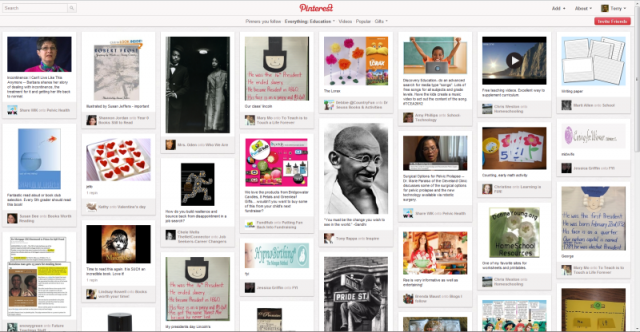

# Projet : Pinterest

- Durée : 7 jours ouvrables
- par groupe de 4 : 
	- 2 frontend developers (1 surtout visual designer, 1 surtout intégrateur) 
	- 2 backend developers (1 surtout responsable Database et déploiement, 1 surtout responsable business code )
- Repository [GitHub](https://github.com/) intitulé "`projet-pinterest`" 
- Git: stratégie des mousquetaires
- Utiliser une structure de fichiers MVC 
- Encore mieux si utilisation d' OOP (mais pas obligé)
- Publier (gratuitement) l'application sur Heroku ([heroku](https://www.heroku.com) - [php/mysql sur heroku](https://stackoverflow.com/questions/14947506/using-mysql-with-php-on-heroku)).

## Demande client : refaire pinterest.com

" J'ai besoin d'un site participatif, permettant à tout le monde de partager des photos de manière anonyme. Le site à construire donnera simplement accès à un formulaire d'upload (téléchargement vers le serveur) et à une liste d'images affichée sous forme de grille. "

" J'aimerais que mon site ressemble à quelque chose comme ceci :  "  
 

" J'ai aussi besoin d'un accès privé me permettant d'effacer, modifier ou d'ajouter des images.

Chaque image est décrite par : 

- le fichier image en lui-même
- un titre (obligatoire)
- une description (facultative)
- la date d'ajout (obligatoire et automatiquement ajouté par mysql à la création)
- le nom de l'uploader (facultatif)

## Modalités de remise
- un repos intitulé exactement `projet-pinterest` disposant de 5 branches (la branche master + 1 par membre du team)
	- le readme du repos :  
		- identifie qui / quoi / quand / comment,
		- contient un lien vers ce briefing ou un bref résumé de la demande initiale
		- contient au moins une capture d'écran de l'application.
		- Indique le score obtenu au [Lighthouse Test](https://developers.google.com/web/tools/lighthouse/)
	- Utilise le "[projects Board](https://liftux.com/using-github-issues-project-management/)" du repo pour la gestion et le suivi des tâches

- L' URL menant à l'écran de départ de ton application (sur Heroku)
- Envoyer le tout via le formulaire Google que nous ferons circuler.
- Envoyer aussi l'URL heroku sur notre channel Ryver (pour montrer votre bébé)

## Fonctionnalités clefs
1. formulaire d'upload en html sémantique
    - sécurité: limiter l'upload uniquement aux formats d'images les plus courants (jpg, jpeg, png, gif, WebP)
    - upload fonctionnel ([référence](https://www.w3schools.com/php/php_file_upload.asp))
1. l'écran d'accueil présente les vignettes clicables des X dernières images
1. Utiliser une grille pour afficher les images.
2. Un écran d'administration derrière écran de login, permettant de gérer les images par un utilisateur "administrateur".
3. Présence d'un favicon

## Objectifs supplémentaires
1. La déployer en Progressive Web App (voir le parcours sur les PWA)
1. Score d'au moins 80/100 au Lighthouse Test.
2. Ajouter un moteur de recherche basique
3. Ajouter une pagination (20 images  par page)
3. Ajouter un système de mots-clef
1. Permettre à l'utilisateur de modifier le cadrage de l'image (via la librairie php [simpleImage](https://github.com/claviska/SimpleImage))
1. Utilise [isotope](https://isotope.metafizzy.co/) pour la mise en page de ton système
1. En PHP lors de l'upload faire de sorte que l'on sauve une miniature et l'image à sa taille normale
1. Faire de sorte que l'on puisse cliquer sur une image et l'affciher dans une modal [Remodal](https://github.com/VodkaBears/Remodal) avec la version normale de l'image
1. (option) Développer un branding original pour l'application : nom + logo + charte de couleurs + typographie (= "système graphique").

## Critères de qualité
- Html de chaque URL est validé par le W3C Validator
- Formulaire accessible
- CSS Responsive
- Score d'au moins 60/100 au Lighthouse Test.
- Les fonctionnalités fonctionnent... (pas de bug)
- interactions avec la DB via PDO et requêtes préparées (pour éviter les injections SQL)
- Code source organisé en MVC
- Bonus si PHP codé en OOP

## Pour commencer...
- Etude de la demande: 
	- as-tu tout compris? Pour le savoir, reformule la demande avec un(e) collègue et comparez votre compréhension mutuelle.
	- Réalise un prototype papier de l'écran à construire.
	- Clarifie pour toi-même ce que doit faire chacune des composantes de ton application, via de l'Unified Modelling Language (UML) ([example 1](http://astah.net/features/uml-features/uml-features-class.png), [example 2](http://msoe.us/taylor/tutorial/se1021/exceptionUML.png))
- Crée un repository sur GitHub "`projet-pinterest`"
- Désignez un(e) coordinateur/trice du projet, qui tiendra à jour le Project Board de suivi des tâches et qui sera aussi le lieutenant du repo.
- Identifiez les tâches
- Répartissez vous les rôles (backend/frontend) et les tâches
- Créez une colone "Todo", "doing", "to merge", "done"
- convenez des étapes de création du projet
- frontend: mockups nécessaires. Faire des user tests par les backend.
- backend: réfléchir à la structure de la db et préparer le MVC
- backend: explorer heroku et ses contraintes et potentiels (faire des tests!)
- La suite?  A vous de vous organiser...

#### Qu'est-ce que je sais déjà faire?
1. Créer un formulaire html
1. Ecrire du html
1. Utiliser un framework CSS 
1. Traiter un formulaire en php  

#### Qu'est-ce qui est nouveau ?
1. PHP: expérimenter avec l'upload
2. déploiement via Heroku
3. utilisation des kanban (Trello, Projects Boards)
4. travail de groupe sur git en mode mousquetaire
5. Faire du user testing (UX)
6. Travail en équipe intensif.

## Ressources

- L'upload en utilisant les fonctions PHP natives est un peu alambiqué. Utilise plutôt la classe "[php upload](https://github.com/verot/class.upload.php)" de Verot.net.

## Teamwork mode !
Vous avez des rôles, mais entraidez-vous. Vous n'êtes pas que backend/frontend, vous êtes d'abord membre d'une équipe. Communiquez, vérifiez, critiquez de manière constructive. Et rappelez-vous:  "cela dépend...".

